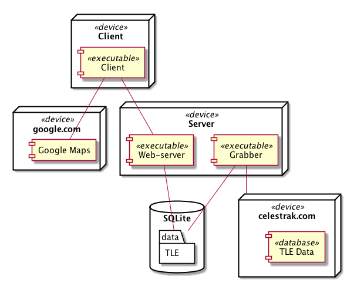

# Анализ космической обстановки

ПО для хранения и анализа параметров космических объектов в соответствии с SGP4.
Написано на JavaScript.

Состоит из трех частей:

* Server - веб-сервер, выдает инфу о спутниках
* Grabber - скачивает и сохраняет в БД инфу о спутниках
* Client - веб-морда

## Использование

### Перед запуском:

Устанавливаем зависимости:
```bash
npm install
```

### Запуск:

Поднимаем сервер:

```bash
node server
```

На клиенте:
```bash
browser 127.0.0.1:3000
```


## Диаграмма развертывания


## Code style
[airbnb](https://github.com/airbnb/javascript)

Все приватные методы классов/модулей имеют вид `_method()`.


## Описание архитектуры

### Клиент

```
se-project/client/
├── assets
│   ├── mypos.png
│   ├── saticon.png
│   └── styles.css
├── index.html
├── index.js
├── info.js
├── list.js
├── map.js
├── model.js
└── utils.js
```

В основе архитектуры 	- [MVP](https://ru.wikipedia.org/wiki/Model-View-Presenter).
Модель - информация о спутниках и об их положениех на орбите в момент времени.
Описывается классами Satellite и OrbElement.
Presenter представлен классами ListComponent, MapComponent, InfoComponent.

