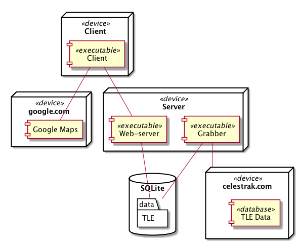

# Анализ космической обстановки

ПО для хранения и анализа параметров космических объектов в соответствии с SGP4.

*Для будущих майнтейнеров: свяжитесь с автором репозитория.*

Состоит из трех частей:

* Веб-сервер — выдает инфу о спутниках
* Граббер — скачивает и сохраняет в БД инфу о спутниках
* Клиент — веб-интерфейс

## Использование

Перед запуском необходимо установить зависимости:
```sh
npm install
```

Поднимаем сервер:
```sh
node server
```

Открываем в браузере `http://localhost:3000`.

Для запуска граббера достаточно набрать:
```sh
node grabber
```

Список TODOs можно получить как:
```sh
egrep '#(TODO|FIXME|XXX)' . -R
```

## Диаграмма развёртывания


## Гайдлайны
1. [Стиль оформления кода](https://github.com/airbnb/javascript)
2. [Стиль оформления сообщений коммитов](https://gist.github.com/stephenparish/9941e89d80e2bc58a153)
3. Приватные методы классов имеют вид `_method()`, свойства по умолчанию приватные, поэтому в префиксе не нуждаются
4. В комментариях принято использовать английский ~~или китайский~~ язык
5. `//#TODO: ...`, `//#FIXME: ...`, `//#XXX: ...`
6. В node.js мы используем последние поддерживаемые фичи из ES2015, а в браузере фичи, которые поддерживаются [ведущими браузерами](https://kangax.github.io/compat-table/es6/)

Для автоматической проверки кодстайла перед коммитами необходимо добавить хук:
```sh
ln -s ../../jscs-pre-commit .git/hooks/pre-commit
```

Возможно, придётся сделать файл исполняемым.

## Описание частей

### Граббер
```sh
grabber
├── extractor.js     # Работа с TLE
├── fetchers         # Фетчеры для разных сайтов
│   ├── celestrak.js
│   └── index.js     # Список активных
├── grabber.js       # Получение TLE
├── informer.js      # Получение информации о спутниках
└── index.js
```

Алгоритм граббера прост: асинхронно запросить все фетчеры, разобрать все полученные TLE и для новых спутников запросить дополнительную информацию.

Для работы с асинхронным кодом используется [подход с генераторами](https://learn.javascript.ru/generator#плоский-асинхронный-код).

### Сервер
```sh
server
├── index.js
├── searcher.js # Поиск подходящих элементов орбиты
└── server.js   # Общение с клиентом
```

В основе сервера лежит паттерн middleware: функции для обработки запросов выстраиваются в цепочку, после чего они перебираются подряд, пока одна из них не обработает запрос.

Для работы со спутниками сервер принимает следующие запросы: `/satellites`, `/info`, `/period`, `/revol`. Подробнее в одноимённых функциях.

Работа с асинхронным кодом осуществляется также посредством генераторов.

### Клиент

```sh
client/
├── assets/*    # Картинки и стили
├── index.html
├── index.js
├── info.js     # Компонент информации о спутнике
├── list.js     # Компонент списка спутников
├── map.js      # Компонент карты
├── model.js    # Информация о спутниках и элементах орбиты
└── utils.js
```

В основе архитектуры лежит [MVP](https://ru.wikipedia.org/wiki/Model-View-Presenter).

- **M**odel — информация о спутниках и элементах орбиты, а так же действия над ними.
- **V**iew — представление данных, html элементы.
- **P**resenter — посредник для связи вида и отображения в обе стороны. Связь «модель → вид» реализуется через вставку шаблонов, а «вид → модель» через связывание данных (data-binding) и dom-события.

Клиент разбит на компоненты, каждый из которых включает в себя часть вида и презентера, модель же общая. Компоненты не связына явно друг с другом, вместо этого каждый из компонентов обладает событиями (паттерн pub/sub). Связывание компонентов происходит в `index.js`.

Клиент с сервера получает лишь информацию о спутниках и элементах орбиты, конкретный путь для отрисовки он предсказывает сам.

Мы решили не усложнять процесс сборки клиента (посредством browserify или duo) и тащить зависимости из сети, по старинке. При таком подходе минимизация зависимостей — первоочередная задача. В том числе поэтому для асинхронного кода используются обещания (`Promise`) без генераторов.
